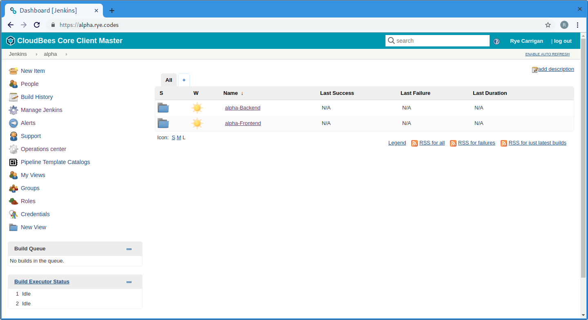
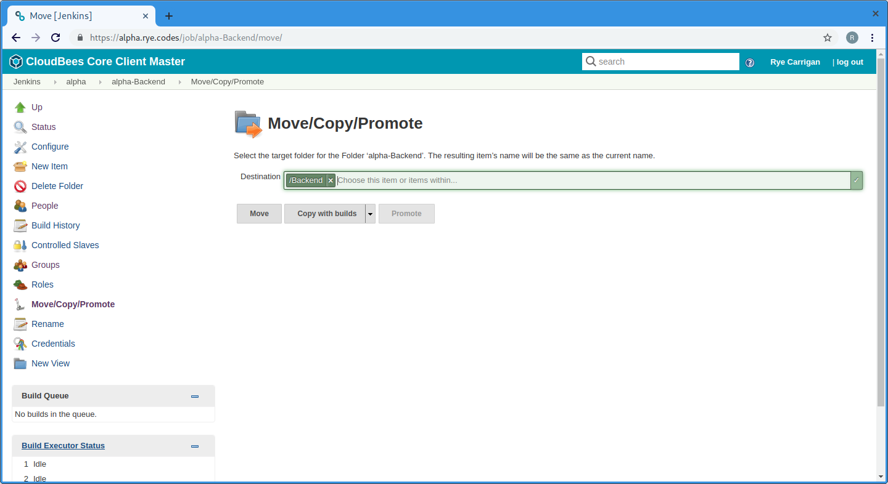
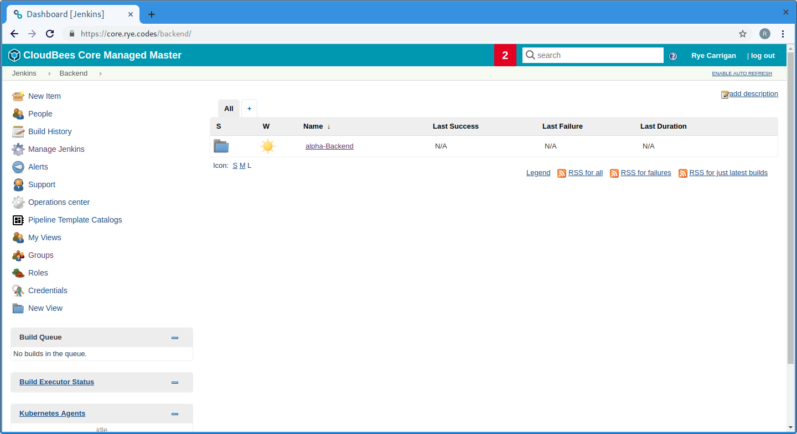

# Facilitating self-service migration of jobs from a Client Master to Managed Master
## Issue
I would like to migrate a Client Master from CloudBees Jenkins Platform ("CJP")
or CloudBees Core for traditional platforms ("Core traditional") to
CloudBees Core for modern cloud platforms ("Core modern"), refactoring a single
CLoudBees Core Client Master ("CM") into multiple CloudBees Core Managed
Masters ("MM").

I would like teams to be able to self-service migrate jobs from CM to MM using
the move/copy/promote functionality.

## Migration strategies 
This scenario resembles the use case mentioned in the
[CloudBees Migration Guide](https://support.cloudbees.com/hc/en-us/articles/216241937-Migration-Guide-CloudBees-Jenkins-Platform-and-CloudBees-Jenkins-Team-)
under Case A, Option B.

### Prerequisites
- An existing installation of Core traditional, AKA the source, with a CM that
  you wish to migrate
- An existing installation of Core modern, AKA the target, with one or many MMs
  to receive migrated jobs from the source CM
  - The target cluster must be reachable from the source CM over the JNLP port
  - For more information on allowing JNLP traffic through the Kubernetes
    ingress controller, see the [this article](https://go.cloudbees.com/docs/cloudbees-core/cloud-install-guide/kubernetes-install/#kubernetes-client-master)
  - For an example YAML configuration for JNLP traffic, [see here](https://github.com/cloudbees/ps-examples/blob/master/cluster-build/cjoc-external-masters.yml)

### Steps

#### Copy RBAC Configuration
1. Extract the RBAC configuration file `$JENKINS_HOME/nectar-rbac.xml` from the
   source CloudBees Jenkins Operations Center ("CJOC") and save a copy to your
   local workspace.
2. Copy this configuration file to the target CJOC
   - Use a `kubectl cp` command to copy the `nectar-rbac.xml` that you
     downloaded from your local workspace into the `JENKINS_HOME` directory
     of the target CJOC:
    ```shell
    kubectl cp nectar-rbac.xml cjoc-0:/var/jenkins_home/nectar-rbac.xml
    ```
3. Restart the target CJOC
4. Enable RBAC authorization strategy on target CJOC
   - Ensure that “Retain any existing role-based matrix authorization strategy
     configuration” is selected

#### Connect source CM to the target CJOC
1. Disconnect the source CM from the source CJOC.
2. Connect the source CM to the target CJOC.
   - From the target CJOC, push connection information to the source CM
   - For more information on adding a CM to Core modern, see [this guide](https://go.cloudbees.com/docs/cloudbees-core/cloud-admin-guide/operating/#client-masters)

#### Validate
1. Ensure RBAC works on the migrated CM
2. Ensure each target MM has the correct RBAC permissions required for teams
   to move jobs using Move/Copy/Promote interface.
   - Teams will need at least the Move Job permission.
   - This is included in the "Developer" role in default RBAC setup

Teams should now be able to move folders and jobs to which they have permissions
from the source CM to their target MM.

#### Example Self Service Migration of a Team Folder
An example user view of a migrated Client Master:


Using Move/Copy/Promote on their folder, users can select the appropriate target
MM as the destination:


After the MCP action completes successfully, the migrated folder will be in
the root of the target MM.

